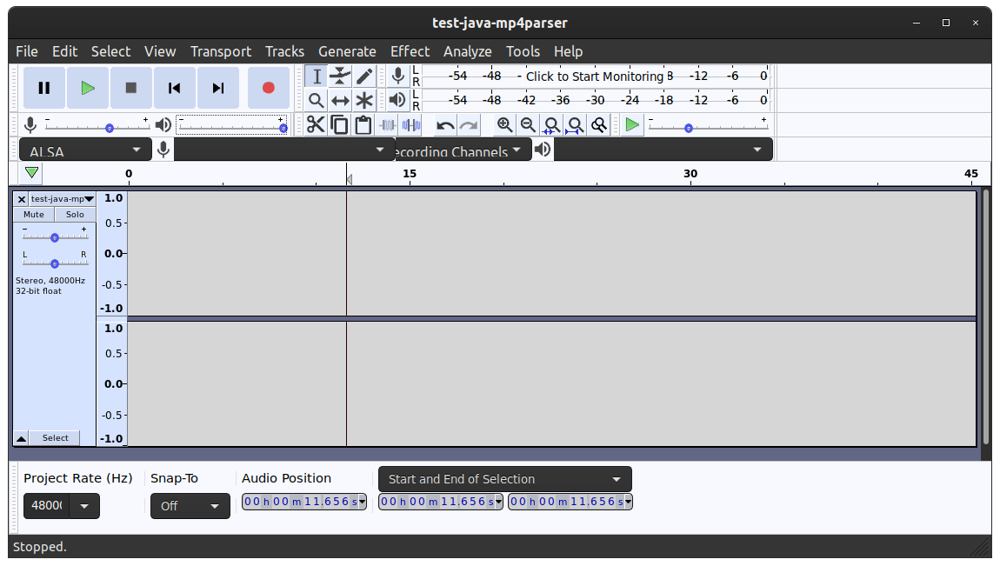
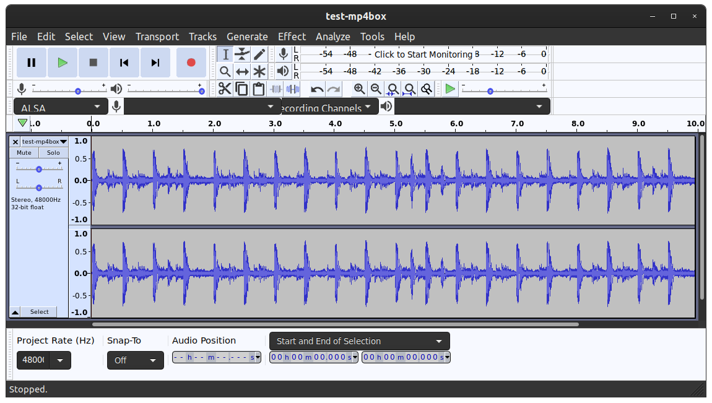

[](https://github.com/charneykaye/encode-fmp4-demo/actions/workflows/main.yml)

## Lab Notes: Individually Encoding Fragmented MP4 Segments

This use case is a service that manually encodes a series of uncompressed .wav media segments into **.m4s** fragments
for broadcast via [MPEG-DASH](https://en.wikipedia.org/wiki/Dynamic_Adaptive_Streaming_over_HTTP),
using [ffmpeg](https://www.ffmpeg.org/) to compress the .wav to .aac
and [sannies/mp4parser](https://github.com/sannies/mp4parser) to assemble the aac audio into a **.m4s** media fragment.

I created this public GitHub project to reproduce the issue in its entirety.

For example, here's the
custom [ChunkFragmentM4sBuilder.java](src/main/java/com/charneykaye/ChunkFragmentM4sBuilder.java) class.

The objective is to build an **.m4s** fragment comprising the box types `SegmentTypeBox`, `SegmentIndexBox`,
and `MovieFragmentBox`. For reference, I have used *mp4parser* to inspect a **.m4s** fragment that was generated
via `ffmpeg -f hls`. This specification is
available [here as a .yaml file](src/test/resources/test5-128k-151304042-ffmpeg.yaml)

## Fragment sequence discontinuity

https://stackoverflow.com/questions/69686039/java-mp4parser-fragment-sequence-discontinuity

The [log](notes/via-java-mp4parser-v2/ChunkFragmentM4sBuilderTest.log.txt) is
from [ChunkFragmentM4sBuilderTest.java](src/test/java/com/charneykaye/ChunkFragmentM4sBuilderTest.java) which results in
the concatenated test output [test-java-mp4parser.mp4](notes/via-java-mp4parser-v2/test-java-mp4parser.mp4) appears to
be ok:


However, when the shipped playlist and segments are played back using VLC, I see these failures in the logs:

```
mp4: Fragment sequence discontinuity detected 163497124 != 0
```

This error happens when VLC plays the following DASH playlist:

- [test5.mpd](notes/via-java-mp4parser-v2/test5.mpd)
- [test5-128k-163497124.m4s](notes/via-java-mp4parser-v2/test5-128k-163497124.m4s)
- [test5-128k-163497125.m4s](notes/via-java-mp4parser-v2/test5-128k-163497125.m4s)
- [test5-128k-163497126.m4s](notes/via-java-mp4parser-v2/test5-128k-163497126.m4s)
- [test5-128k-IS.mp4](notes/via-java-mp4parser-v2/test5-128k-IS.mp4)

And here is the latest implementation of my custom fragment builder class, and additional notes:

```java
Files.deleteIfExists(Path.of(m4sFilePath));
        AACTrackImpl aacTrack=new AACTrackImpl(new FileDataSourceImpl(aacFilePath));
        Movie movie=new Movie();
        movie.addTrack(aacTrack);
        Container mp4file=new ChunkFragmentM4sBuilder(seqNum).build(movie);
        FileChannel fc=new FileOutputStream(m4sFilePath).getChannel();
        mp4file.writeContainer(fc);
        fc.close();
```

- [ChunkFragmentM4sBuilderTest.log.txt](notes/via-java-mp4parser-v2/ChunkFragmentM4sBuilderTest.log.txt)
- [test5-128k-IS.mp4](notes/via-java-mp4parser-v2/test5-128k-IS.mp4)
- [test-java-mp4parser.mp4](notes/via-java-mp4parser-v2/test-java-mp4parser.mp4)

### Solved by rebuilding ChunkFragmentM4sBuilder from FragmentedMp4Builder

This isn't properly an answer to the question, ***but*** I was able to resolve the issue by rebuilding my ChunkFragmentM4sBuilder class from Sebastian Annies FragmentedMp4Builder instead of his DefaultMp4Builder class (from the original mp4parser builders)

https://github.com/charneykaye/encode-fmp4-demo/commit/b90f05d6eb59dd1ad6394df40479f36347846dcb


## Java mp4parser output is empty

https://stackoverflow.com/questions/69684510/java-mp4parser-output-is-empty

The first example using MP4 box works, insofar as I am able to generate an initializing MP4 + series of fragment M4s
files which can then be concatenated to form a playable MPEG4 stream.

Note: it's a requirement for this use case that each media segment is encoded from an individually generated source
segment, versus using a tool such as MP4Box to stream from a continuous audio source.

Attempts to manually build media segments via mp4parser are still failing overall, because the fragments written by
my [ChunkFragmentM4sBuilderV1.java](src/main/java/com/charneykaye/ChunkFragmentM4sBuilderV1.java) used below are
malformed. But I'm having a difficult time understanding *how* exactly they are malformed.

It's been helpful for me to compare the two test logs side by
side, [ChunkFragmentM4sBuilderTest.log.txt](notes/via-java-mp4parser/ChunkFragmentM4sBuilderTest.log.txt)
and [MP4BoxTest.log.txt](notes/via-mp4box/MP4BoxTest.log.txt).

### via Java mp4parser (malformed)

The former [log](notes/via-java-mp4parser/ChunkFragmentM4sBuilderTest.log.txt) is
from [ChunkFragmentM4sBuilderTest.java](src/test/java/com/charneykaye/ChunkFragmentM4sBuilderTest.java) which results in
the concatenated test output [test-java-mp4parser.mp4](notes/via-java-mp4parser/test-java-mp4parser.mp4) which is in
fact empty:



```java
Files.deleteIfExists(Path.of(m4sFilePath));
        AACTrackImpl aacTrack=new AACTrackImpl(new FileDataSourceImpl(aacFilePath));
        Movie movie=new Movie();
        movie.addTrack(aacTrack);
        Container mp4file=new ChunkFragmentM4sBuilderV1(hz,seconds,seqNum,bufferSize).build(movie);
        FileChannel fc=new FileOutputStream(m4sFilePath).getChannel();
        mp4file.writeContainer(fc);
        fc.close();
```

- [test5.mpd](notes/via-java-mp4parser/test5.mpd)
- [test5-128k-163493804.m4s](notes/via-java-mp4parser/test5-128k-163493804.m4s)
- [test5-128k-163493805.m4s](notes/via-java-mp4parser/test5-128k-163493805.m4s)
- [test5-128k-163493806.m4s](notes/via-java-mp4parser/test5-128k-163493806.m4s)
- [test5-128k-IS.mp4](notes/via-java-mp4parser/test5-128k-IS.mp4)

### via MP4Box (ok)

The latter [log](notes/via-mp4box/MP4BoxTest.log.txt) is
from [MP4BoxTest.java](src/test/java/com/charneykaye/MP4BoxTest.java) which results in the concatenated test output
[test-mp4box.mp4](notes/via-mp4box/test-mp4box.mp4) which is OK:



```shell
MP4Box \
  -profile live \
  -add aacFilePath \
  -dash 10000 \
  -frag 10000 \
  -idx ${NUM} \
  -moof-sn ${NUM} \
  -out test5.mpd \
  -segment-name test5-128k- \
  -segment-ext m4s \
  -single-traf \
  -subsegs-per-sidx 0 \
  -daisy-chain \
  -single-segment \
  /tmp
```

- [test5.mpd](notes/via-mp4box/test5.mpd)
- [test5-128k-163494320.m4s](notes/via-mp4box/test5-128k-163494320.m4s)
- [test5-128k-163494321.m4s](notes/via-mp4box/test5-128k-163494321.m4s)
- [test5-128k-163494322.m4s](notes/via-mp4box/test5-128k-163494322.m4s)
- [test5-128k-IS.mp4](notes/via-mp4box/test5-128k-IS.mp4)

## Fragmented MP4 has moof, not moov

https://stackoverflow.com/questions/69625970/java-mp4parser-to-create-a-single-m4s-fragment-invalid-moov-box/

My implementation created an MP4 without error. But, when the unit test attempts to read the file that the
ChunkMp4Builder just wrote to a temp folder:

```
java.lang.RuntimeException: A cast to int has gone wrong. Please contact the mp4parser discussion group (3724673092)
	at org.mp4parser.tools.CastUtils.l2i(CastUtils.java:30)
	at org.mp4parser.support.AbstractBox.parse(AbstractBox.java:97)
	at org.mp4parser.AbstractBoxParser.parseBox(AbstractBoxParser.java:116)
	at org.mp4parser.BasicContainer.initContainer(BasicContainer.java:107)
	at org.mp4parser.IsoFile.<init>(IsoFile.java:57)
	at org.mp4parser.IsoFile.<init>(IsoFile.java:52)
	at com.charneykaye.TestBase.getMp4Boxes(TestBase.java:116)
	at com.charneykaye.ChunkFragmentM4sBuilderTest.run(Mp4parserTest.java:78)
```

The expected box types `SegmentTypeBox`, `SegmentIndexBox`, and `MovieFragmentBox` do appear in the output:

[![The expected box types `SegmentTypeBox`, `SegmentIndexBox`, and `MovieFragmentBox` do appear in the output][2]][2]

However, at the end of the file appears a box of an unknown type:

[![There seems to be a box of an unknown type, appearing at the end of the file.][3]][3]

### Solved by [@aergistal](https://stackoverflow.com/users/4663670/aergistal)

See diagram of Fragmented MP4 (fmp4): https://bitmovin.com/wp-content/uploads/2019/07/image7.png

Your `m4s` segments are invalid due to an incorrect `mdat` atom size.

For example in `test5-128k-151304042.m4s` the `mdat` is marked as having a length of 16 bytes but there is data at the
end and file size is 164884.

The parser then attempts to read an invalid offset. `avc5` is not an atom but actually part of the string "
Lavc58.54.100". The length read as 3724673100 is also invalid and greater than the max for a 32-bit integer, hence the
invalid cast to int.

[![hex dump][1]][1]


----------

In your implementation you have:

    ParsableBox moov = createMovieFragmentBox(movie);
    isoFile.addBox(moov);
    List<SampleSizeBox> stszs = Path.getPaths(moov, "trak/mdia/minf/stbl/stsz");
    // ...

    protected MovieFragmentBox createMovieFragmentBox(Movie movie) {
        MovieFragmentBox mfb = new MovieFragmentBox();
        // ...
    }

This is not a `moov` atom, it's a `moof`. There is no `stsz` in there and the sum of your sample sizes is 0 so the total
calculated size of the `mdat` is 16 + 0.

The `moov` is supposed to be in the initialization segment.


[1]: https://i.stack.imgur.com/4z7gE.jpg


[2]: https://i.stack.imgur.com/aAmyt.png

[3]: https://i.stack.imgur.com/pHJeJ.png
